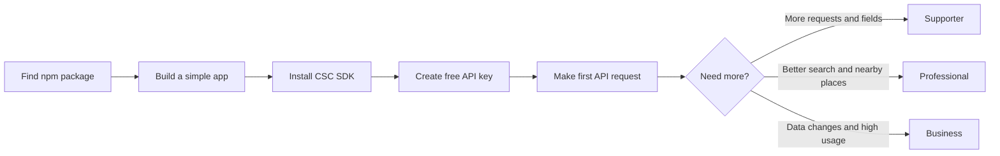

# PRD: Move npm Users to the CSC API

**Status:** Draft for approval  
**Owner:** CountryStateCity  
**Updated:** 2026-08-12  
**Task list:** [docs/specs/README.md](./specs/README.md)

## What we want to do

Keep the open-source npm packages useful for offline and simple apps. Make the live CSC API the better choice when an app needs:

- New data without waiting for an npm release.
- Clean city and admin-place filters.
- Fast server search.
- Search that can fix spelling mistakes.
- Names in different languages.
- Places near a latitude and longitude.
- Higher request limits and support.
- A list of data changes.

We will not remove npm features only to make people pay for the API.

## Why we are doing this

During the 30 days ending 2026-08-09:

- `@countrystatecity/countries` had about 72,900 downloads.
- `@countrystatecity/countries-browser` had about 12,900 downloads.
- `@countrystatecity/cli` had 84 downloads.

Many developers already find CSC through npm. Very few move to the API tools. The main reasons are:

- There is no official JavaScript/TypeScript API SDK.
- npm README files do not clearly explain when to use the API.
- The CLI does not show the strongest paid API features.
- Customers must build autocomplete and nearby search themselves.
- The business cannot clearly measure npm-to-API conversion.

## Where the work should go

| GitHub repository | Work |
|---|---|
| [`dr5hn/countrystatecity-npm`](https://github.com/dr5hn/countrystatecity-npm) | npm data packages, new API SDK, data scripts, and current CLI |
| [`dr5hn/csc-app`](https://github.com/dr5hn/csc-app) | API server in `api/` and customer dashboard in `web/` |
| [`dr5hn/csc-website-v2`](https://github.com/dr5hn/csc-website-v2) | Public website and pricing page |
| [`dr5hn/csc-docs`](https://github.com/dr5hn/csc-docs) | Public documentation |
| [`dr5hn/csc-swagger`](https://github.com/dr5hn/csc-swagger) | API playground |
| [`dr5hn/countries-states-cities-database`](https://github.com/dr5hn/countries-states-cities-database) | Source data; most tasks read from it but do not change it |

## What success looks like

> A developer starts with local npm data, moves to the live API with a small code change, tries paid search in the playground, and upgrades when the app needs more.

## What each product is for

| Product | Best use |
|---|---|
| npm packages | Offline apps, fixed data, and simple dropdowns |
| Community API | Try live data with 3,000 requests per month |
| Starter API | More requests and ISO lookup |
| Supporter API | More fields, filters, sorting, and code generation |
| Professional API | Translations, spelling-friendly search, autocomplete, and nearby search |
| Business API | Highest request limits and data change list |

## Main goals

1. Publish an easy TypeScript SDK for the API.
2. Help npm and CLI users start the free API.
3. Give paid users useful search and location features.
4. Separate normal settlements from counties and other admin places.
5. Show which data version every API or npm package uses.
6. Keep old npm and API users working.

## Work plan

Each item has its own simple task file.

### Step 1: Basic work

1. [Download and check source data](./specs/01-data-ingestion-and-manifest.md)
2. [Separate cities from admin places](./specs/02-place-classification.md)
3. [Keep plans and feature access in one place](./specs/03-entitlements-and-errors.md)
4. [Show the data version](./specs/04-data-version-metadata.md)

### Step 2: Help npm users start the API

5. [Build the TypeScript API SDK](./specs/05-typescript-api-sdk.md)
6. [Measure npm-to-API conversion](./specs/06-conversion-analytics.md)
7. [Improve npm and website API links](./specs/07-npm-docs-funnel.md)
8. [Improve the CLI](./specs/08-cli-api-experience.md)

### Step 3: Add paid search features

9. [Build location autocomplete](./specs/09-autocomplete-api.md)
10. [Generate ready-to-use location UI](./specs/10-location-component-generators.md)
11. [Find places near a location](./specs/11-nearby-search.md)
12. [Add translated state and city names](./specs/12-localized-place-data.md)

### Step 4: Add a Business data-update feature

13. [Show what data changed](./specs/13-data-change-feed.md)

See the [task list](./specs/README.md) for the correct work order.

## Which plans get each feature

| Feature | Community | Starter | Supporter | Professional | Business |
|---|---:|---:|---:|---:|---:|
| SDK, CLI, and basic location data | Yes | Yes | Yes | Yes | Yes |
| ISO lookup | No | Yes | Yes | Yes | Yes |
| Server filters, fields, and sorting | No | No | Yes | Yes | Yes |
| More fields and code generators | No | No | Yes | Yes | Yes |
| Autocomplete and spelling-friendly search | Playground | Playground | Playground | Yes | Yes |
| Nearby search | Playground | Playground | Playground | Yes | Yes |
| Full translations and WikiData | No | No | No | Yes | Yes |
| Data change list | No | No | No | No | Yes |

Clean place groups and data-version information are available on every plan. Correct data should not be a paid-only feature.

## How we will measure success

Save the current numbers for 30 days before launch. Goals for the first 90 days:

- 1,000 API keys created from npm, SDK, or CLI links.
- 30% of those keys make a successful request within 24 hours.
- 20% use the API again in another week.
- 5% move from free to a paid plan.
- 25% of Professional customers use fuzzy, autocomplete, or nearby search each month.
- New search routes work successfully at least 99.9% of the time.
- Common cached searches finish in less than 150 ms.
- Other searches finish in less than 300 ms.
- Downloads of the two main npm packages do not fall greatly.

## Rules for every task

- Keep old working API and npm behavior unless a separate change is approved.
- Add new response fields; do not rename or remove old fields.
- Never show API keys in URLs, logs, errors, generated code, or reports.
- Check user input before using it in a database query.
- Only allow approved field and sort names.
- Do not add hidden tracking to npm packages or the SDK.
- Keep the required source-data credit and ODbL license notice.
- Make new data live only after all checks pass.
- Add tests and public documentation for every new feature.
- Generated user interfaces must work with keyboard and screen reader.

## Agreed starting choices

- SDK package name: `@countrystatecity/sdk`.
- Lower plans can try paid search in the public playground only.
- Add `kind=settlement`, but do not change the normal `/cities` result yet.
- Keep data changes for 90 days.
- Keep the SDK at 20 kB or less after compression.
- Nearby search maximum distance: 500 km.
- Nearby search maximum results: 100.

## This project is finished when

- All 13 tasks pass their “Done when” checks.
- The SDK is published and the CLI uses it.
- npm README files show a clear free-API path.
- All products show the same plans and limits.
- Cleaner place filters are live.
- Autocomplete, translations, and nearby search work through the API and SDK.
- API and npm users can see their data version.
- Business users can request a stable list of data changes.
- The team can see API conversion, speed, and error reports.

## Not part of this project

- Removing existing npm data or methods.
- Putting all translations or search indexes inside browser npm packages.
- Street-address search or address checking.
- Country/state map boundary shapes.
- A worldwide counties product.
- GraphQL before the REST features prove useful.
- New npm wrappers for the source Parquet, SQLite, or TOON files.

## References

- [CSC pricing](https://countrystatecity.in/pricing/)
- [CSC SDK documentation status](https://docs.countrystatecity.in/api/sdks)
- [CSC fuzzy-search API](https://docs.countrystatecity.in/api/endpoints/fuzzy-search)
- [Source database](https://github.com/dr5hn/countries-states-cities-database)
- [Source city type guide](https://github.com/dr5hn/countries-states-cities-database/blob/master/TYPE_FIELD.md)
- [Source city/county issue](https://github.com/dr5hn/countries-states-cities-database/issues/1303)
